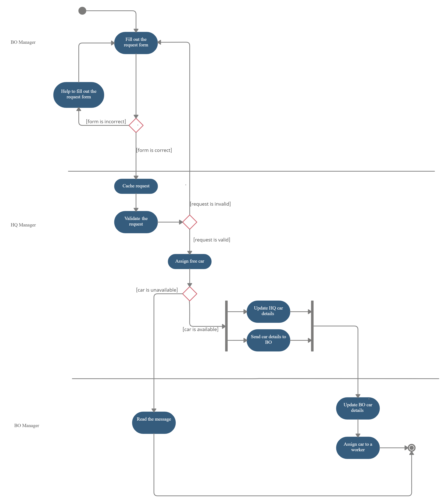
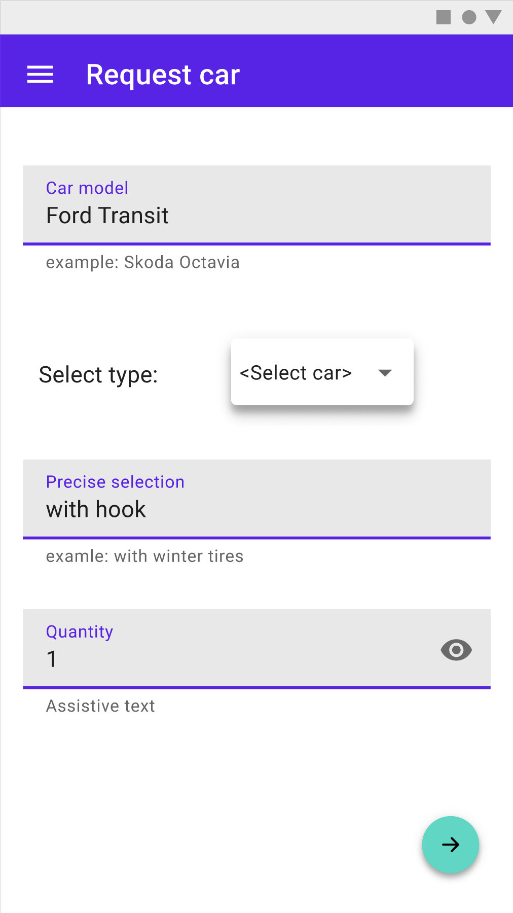

# Fleet management system

| ℹ️  |  This documentation is available online here: https://sosnus.github.io/iap-client/ |
| --- | --- |

## Team

* Monika Rosa
* Godfrey Mghase
* Stanisław Puławski
* Wiktor Muraszko

## Description
The main objective of this project is to create a IT System for managing car fleet for the company, which consists of a headquarter and few branch offices located in different cities (Lodz, Warsaw, Cracow). Our solution connects the information systems of company's headquarters and its branches and allows enterprise to manage their car fleet. We have prepared working Web Service and Flutter Android client.

### **Repositories**
Backend repository: https://github.com/Wredter/IAP_project_1

Frontend, documentation and scripts: https://github.com/sosnus/iap-client

## Technology stack

* Database
    * MySQL `MySQL Server 8.0.23-1debian10`
* Backend
    * Java Spring `Spring Boot (v2.4.3)`
* Frontend
    * Flutter `Flutter 2.0.3`
        * Android 
        * Web 
        * Web container 


# Report 1 - Feasibility study of communication between systems

| ℹ️  |  the purpose of the first report is presentation connection between database, backend and frontend applications |
| --- | --- |


First, test deploy consist of 3 parts:
* MySQL database
* Spring boot backend service
* Flutter Android client

For communication test purpouse, database and backend was deployed on docker containers, on the same Virtual Machine. VM size: Standard B1ms 1vCPU, 2GB RAM
* Backend addr: http://s-vm.northeurope.cloudapp.azure.com:8081/
* Database addr: http://s-vm.northeurope.cloudapp.azure.com:3306/


Before container deployment, it is necessary to enable new firewall rules:
```bash
ufw allow 22
ufw allow 3306
ufw allow 8081
ufw reload
```

## Database - deploy and test

For database deployment, we use simple bash script to run new docker container from Docker Hub

```bash

docker run --name some-mysql -p 3306:3306 -e MYSQL_ROOT_PASSWORD=my-secret-pw -d mysql

```

We create first sql schema for this project using dbdiagram.io tool. Probably we will have some changes here in the future. Online documentation for our schema is here: https://dbdiagram.io/d/6053d308ecb54e10c33c2951 


 

Next we create new database users to enable easy synchronous access for the rest of the team members. It is important for future deployments, we need independent user for every backend instance. Here is how we created the users.

```sql
CREATE USER 'moderator1'@'%' IDENTIFIED BY '1234';
GRANT ALL PRIVILEGES ON * . * TO 'moderator1'@'%';
FLUSH PRIVILEGES;

```

Next we add dump data for testing using the script below.

```sql
INSERT INTO `users` (`id`, `first_name`, `middle_name`, `surname`, `pesel`, `gender`, `birth_date`, `role`, `office_id`) VALUES

(1020, 'Ruth', 'Elion', 'Musk', 19021989, 'M', '2020-10-20', 'admin', '23'),
(1021, 'Monika', '', 'Rosa', 19021989, 'F', '1997-04-20', 'client', '24'),
(1023, 'Stanley', '', 'Murashko', 1902198, 'M', '1999-08-09', 'client', '23'),
(1024, 'Godfrey', '', 'Muga', 1902198, 'M', '1999-08-10', 'admin', '24');

INSERT INTO `cars` (`worker_id`, `plate_number`, `license_number`, `model`) VALUES
(1020, '1520', '5060', 'Toyota'),
(1021, '1521', '5061', 'Nissan'),
(1023, '1522', '5062', 'Hundai'),
(1024, '1523', '5063', 'Toyota');

INSERT INTO `offices` (`id`, `city`, `type`) VALUES
(23, 'Lodz', 'HQ'),
(24, 'Warsaw', 'BO');

```

We test Our database deployment using DBeaver desktop app:


## Backend - deploy and test

To deploy backend application, we need build container from source code and run it, using commands below:
```bash
git clone https://github.com/Wredter/IAP_project_1
cd ./IAP_project_1
docker stop iap-back-container -t 1
docker rm iap-back-container
docker build --no-cache -t iap-back .
docker run -d -p 8081:80 --name=iap-back-container iap-back
```

Now we can test backend project, by send http get request on `/hello` endpoint. In Our case, we can see it on addr: `http://s-vm.northeurope.cloudapp.azure.com:8081/hello`


On endpoint `/users` we can see list of `elements` from `users` collections


## Frontend - test
For first project iteration, we need implement a few features in frontend application:
* Connection to API
* Users model
* User list view


### Connection to API
Class `FleetService` contains access to backend API using `package:http/http.dart` library
### Users 
User class is very simple, and help us to present data from Users collection from backend. We add it for test purpose, in next iteration this class will be modified, and contain expanded constructors and other methods
```dart
class User {
  int id;
  String pesel;
  String firstName;
  String sureName;

  User({this.id, this.pesel, this.firstName, this.sureName});
}
```

### User list view
Main part of view in this project is builder, which can dynamic add new elements to ListView collection
```dart
Builder(
        builder: (_) {
          if (_isLoading) {
            return Center(child: CircularProgressIndicator());
          }

          if (_apiResponse.error) {
            return Center(child: Text(_apiResponse.errorMessage));
          }

          return ListView.separated(
            separatorBuilder: (_, __) =>
                Divider(height: 1, color: Colors.green),
            itemBuilder: (_, index) {
              return Dismissible(
                key: ValueKey(_apiResponse.data[index].id),
                direction: DismissDirection.startToEnd,
                onDismissed: (direction) {},
                confirmDismiss: (direction) async {
                  final result = await showDialog(
                      context: context, builder: (_) => UserDelete());
                  print(result);
                  return result;
                },
                background: Container(
                  color: Colors.red,
                  padding: EdgeInsets.only(left: 16),
                  child: Align(
                    child: Icon(Icons.delete, color: Colors.white),
                    alignment: Alignment.centerLeft,
                  ),
                ),
                child: ListTile(
                    title: Text(
                      _apiResponse.data[index].sureName,
                      style: TextStyle(color: Theme.of(context).primaryColor),
                    ),
                    subtitle: Text('PESEL: ${_apiResponse.data[index].pesel}'),
                    onTap: () {}),
              );
            },
            itemCount: _apiResponse.data.length,
          );
        },
      ),
```
Application get list of users using service `fleet_service`, convert it into list of `User` objects, and present it as `ListTile` widgets:


## references and sources for 1st report
* REST API in flutter: https://www.youtube.com/watch?v=M8zM48Jytv0
* Flutter documentation: https://flutter.dev/docs
* Create database users: https://www.digitalocean.com/community/tutorials/how-to-create-a-new-user-and-grant-permissions-in-mysql


# Report 2 - Establish the business context, sketch the system architecture, select technology
## System actors
* Headquarters Manager - Headquarters Manager represents a system role with the authorization to assign car to the branch office, update HQ car details.
* Branch Office Manager - Branch Office Manager represents a system role with the authorization to fill out the request form for the car, assign car to a worker, update BO car details.

## Activity diagram


## Deployment diagram


## Description of use cases 
### 1. Fill out the request form (when worker needs new car)
* Type: general 
* Users: Branch Office Manager 
* Initial conditions: Branch Office Manager confirmed their identity via login and password.
* Typical step sequence:  
1. Branch Office Manager chooses an option to fill out the request form. 
2. BO Manager fills out the request form 
* Alternative sequence of steps:  
2a. Request form was filled incorrectly, BO Manager repeats filling process. 
2b. Request form was filled incorrectly, BO Manager displays help video and repeats the process. 
* Final conditions: the request form has been successfully filled. 

### 2. Assign free car (to branch) 
* Type: general
* Users: Headquarters Manager 
* Initial conditions: Headquarters Manager confirmed their identity via login and password. 
* Typical step sequence:  
1. Cache requests
2. The request validation 
3. HQ Manager assigns free car 
4. Update HQ car details 
5. Send car details to BO 
* Alternative sequence of steps: 
2a. The request is invalid (error message is sent to BO)  
3a. There is no free car (notification is sent to BO) 
* Final conditions: the free car has been assigned to BO 

### 3. Assign car to a worker 
* Type: general
* Users: Branch Office Manager 
* Initial conditions: Branch Office Manager confirmed their identity via login and password. 
* Typical step sequence:
1. Branch Office Manager assigns car to the worker. 
2. BO car details are updated. 
* Final conditions: car is assigned to worker.

## References and sources for 2nd report
* http://www.agilemodeling.com/artifacts/deploymentDiagram.htm
* http://www.agilemodeling.com/style/activityDiagram.htm


<!-- # Report 3 TEMPORARY


| Request form | Request list | Request liew |
| --- | --- |--- |
|  |  |  |
| --- | --- |--- |
 -->
