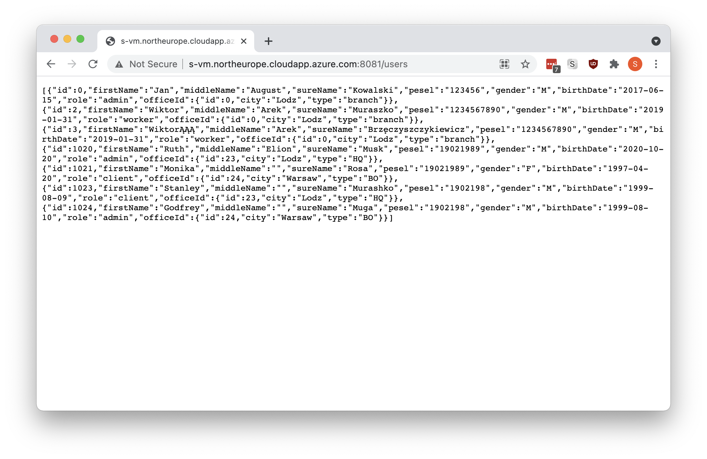
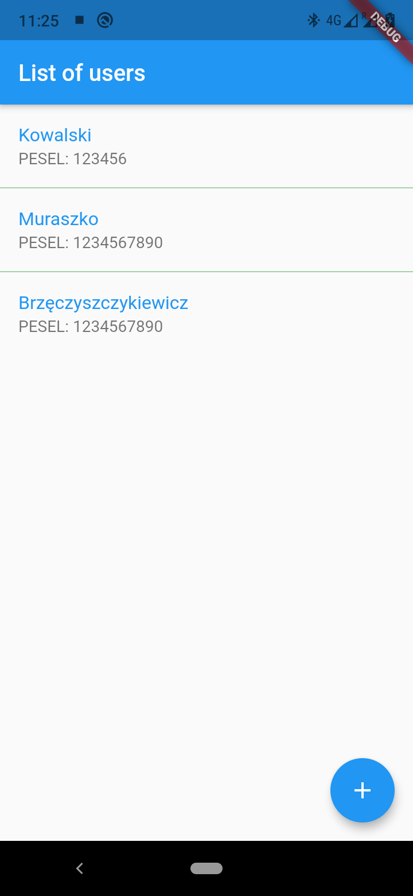

# Fleet management system

This documentation is available online here: https://sosnus.github.io/iap-client/ 
## Team

* Monika Rosa
* Godfrey Mghase
* Stanisław Puławski
* Wiktor Muraszko

## Description
The main objective of this project is to create a IT System for managing car fleet for the company, which consists of a headquarter and few branch offices located in different cities (Lodz, Warsaw, Cracow). Our solution connects the information systems of company's headquarters and its branches and allows enterprise to manage their car fleet. We have prepared working Web Service and Flutter Android client.

### Repositories
Backend repository: https://github.com/Wredter/IAP_project_1

Frontend, documentation and scripts: https://github.com/sosnus/iap-client

## Technology stack

* Database
    * MySQL `MySQL Server 8.0.23-1debian10`
* Backend
    * Java Spring `Spring Boot (v2.4.3)`
* Frontend
    * Flutter `Flutter 2.0.3`
        * Android 
        * Web 
        * Web container 


# Report 1 - Feasibility study of communication between systems

First, test deploy consist of 3 parts:
* MySQL database
* Spring boot backend service
* Flutter Android client

For communication test purpouse, database and backend was deployed on docker containers, on the same Virtual Machine.
* Backend addr: http://s-vm.northeurope.cloudapp.azure.com:8081/
* Database addr: http://s-vm.northeurope.cloudapp.azure.com:3306/

Before container deployment, it is necessary to enable new firewall rules:
```bash
ufw allow 22
ufw allow 3306
ufw allow 8081
ufw reload
```

## Database - deploy and test

For database deployment, we use simple bash script to run new docker container from Docker Hub

```bash

docker run --name some-mysql -p 3306:3306 -e MYSQL_ROOT_PASSWORD=my-secret-pw -d mysql

```

We create first sql schema for this project using dbdiagram.io tool. Probably we will have some changes here in the future. Online documentation for our schema is here: https://dbdiagram.io/d/6053d308ecb54e10c33c2951 


 

Next we create new database users to enable easy synchronous access for the rest of the team members. Here is how we created the users.

```sql
CREATE USER 'moderator1'@'%' IDENTIFIED BY '1234';
GRANT ALL PRIVILEGES ON * . * TO 'moderator1'@'%';
FLUSH PRIVILEGES;

```

Next we add dump data for testing using the script below.

```sql
INSERT INTO `users` (`id`, `first_name`, `middle_name`, `surname`, `pesel`, `gender`, `birth_date`, `role`, `office_id`) VALUES

(1020, 'Ruth', 'Elion', 'Musk', 19021989, 'M', '2020-10-20', 'admin', '23'),
(1021, 'Monika', '', 'Rosa', 19021989, 'F', '1997-04-20', 'client', '24'),
(1023, 'Stanley', '', 'Murashko', 1902198, 'M', '1999-08-09', 'client', '23'),
(1024, 'Godfrey', '', 'Muga', 1902198, 'M', '1999-08-10', 'admin', '24');

INSERT INTO `cars` (`worker_id`, `plate_number`, `license_number`, `model`) VALUES
(1020, '1520', '5060', 'Toyota'),
(1021, '1521', '5061', 'Nissan'),
(1023, '1522', '5062', 'Hundai'),
(1024, '1523', '5063', 'Toyota');

INSERT INTO `offices` (`id`, `city`, `type`) VALUES
(23, 'Lodz', 'HQ'),
(24, 'Warsaw', 'BO');

```

We test Our database deployment using DBeaver desktop app:


## Backend - deploy and test

To deploy backend application, we need build container from source code and run it, using commands below:
```bash
git clone https://github.com/Wredter/IAP_project_1
cd ./IAP_project_1
docker stop iap-back-container -t 1
docker rm iap-back-container
docker build --no-cache -t iap-back-container --build-arg .
docker run -d -p 80:8081 --name=iap-back-container iap-back
```

Now we can test backend project, by send http get request on `/hello` endpoint. In Our case, we can see it on addr: `http://s-vm.northeurope.cloudapp.azure.com:8081/hello`


On endpoint `/users` we can see list of `elements` from table `users`



## Frontend - test
For first project iteration, we need implement a few features in frontend application:
* Connection to API
* Users model
* User list view

### Users 
TODO$$$$$$$



## references and sources for 1st report
* REST API in flutter: https://www.youtube.com/watch?v=M8zM48Jytv0
* Flutter documentation: https://flutter.dev/docs
* Create database users: https://www.digitalocean.com/community/tutorials/how-to-create-a-new-user-and-grant-permissions-in-mysql


# Report 2 - Establish the business context, sketch the system architecture, select technology